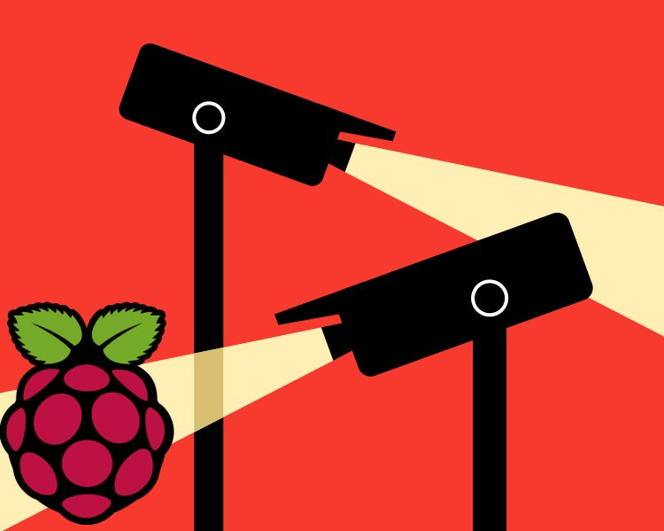
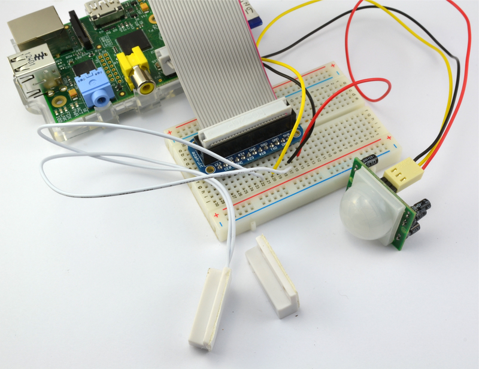
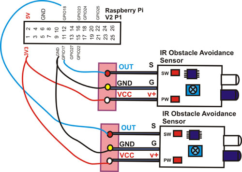

# pi-plugins
This repository helps with the Raspberry pi plugins for sensors it will support python 3.5.3 and greater, Though it is also open to  python 2.7.13 and greater

### Camera module will work in the following 
**Sense the sound and Capture the picture**  
**Capture the image at which the object has collided**
**Stream the video or capture the process at which the robot is moving**

### Motion sensor

**Its fuctional purpose is to check the state at which the object is moving**  

### Infrared Sensor 

**Infrared sensor for objects detection**  

more are to come 
